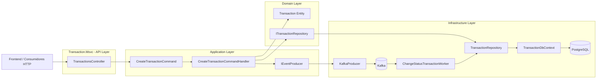

# Transaction Service — MSVC.Transaction

Servicio backend encargado de gestionar el ciclo de vida de transacciones financieras, implementado con **.NET 8**, **Arquitectura Hexagonal / Clean Architecture**, **DDD**, **CQRS**, **EF Core**, **Kafka** y **Workers resilientes con Polly**.

Este servicio permite:

- Crear transacciones
- Publicar eventos a Kafka cuando una transacción es creada
- Escuchar eventos antifraude
- Actualizar el estado de la transacción según resultado externo
- Persistir el estado final en PostgreSQL

---

## 🧱 Arquitectura General

El servicio está diseñado bajo principios de **Arquitectura Hexagonal**, separando responsabilidades en capas independientes:

```
MSVC.Transaction/
└── src/
    ├── Transaction.Msvc/                 # API Layer (Presentación)
    │   ├── Controllers/
    │   │   └── TransactionsController.cs
    │   ├── Middleware/
    │   │   └── ExceptionMiddleware.cs
    │   ├── Program.cs
    │   ├── appsettings.json
    │   └── appsettings.Development.json

    ├── Transaction.Application/          # Application Layer (CQRS)
    │   ├── Commands/
    │   ├── DTOs/
    │   ├── Interfaces/
    │   ├── Events/
    │   ├── Common/
    │   └── ApiResponse.cs

    ├── Transaction.Domain/               # Domain Layer
    │   ├── Entities/
    │   ├── Enums/
    │   ├── Interfaces/
    │   └── Exceptions/

    └── Transaction.Infrastructure/        # Infrastructure Layer
        ├── DbContext/
        ├── Repositories/
        ├── Kafka/
        ├── Workers/
        ├── Settings/
        ├── Migrations/
        └── ServiceRegistration.cs
```

---

## 🧩 Diagrama de Arquitectura



---

## 🔄 Flujo Completo de una Transacción

### 1. Creación de transacción
- El cliente usa `POST /api/transactions`
- La API envía un `CreateTransactionCommand` usando MediatR
- El Handler:
  - Crea la entidad de dominio `Transaction`
  - La persiste en PostgreSQL
  - Publica `TransactionCreatedEvent` en Kafka

### 2. Procesamiento antifraude
- Servicio externo escucha `transaction.created`
- Evalúa la transacción
- Publica `ChangeStatusTransactionEvent` al topic `transaction.validated`

### 3. Worker de actualización
- Escucha eventos validados
- Usa Polly para reintentos
- Actualiza el estado en BD
- Confirma offset en Kafka

---

## 🐳 Ejecución con Docker

```bash
docker-compose up --build -d
```

### Servicios

| Servicio  | Puerto |
|----------|--------|
| API      | 5000   |
| Kafka UI | 8080   |
| pgAdmin  | 8081   |
| Postgres | 5432   |

---

## 🧪 Endpoint Principal

### POST /api/transactions

```json
{
  "sourceAccountId": "GUID",
  "targetAccountId": "GUID",
  "transferTypeId": 1,
  "value": 4500
}
```

---

